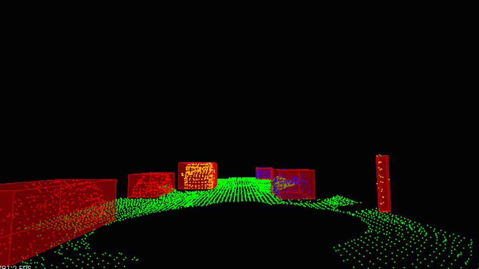

# Lidar



In this course we will be talking about sensor fusion, which is the process of taking data from multiple sensors and combining it to give us a better understanding of the world around us. We will mostly be focusing on two sensors, lidar, and radar. By the end we will be fusing the data from these two sensors to track multiple cars on the road, estimating their positions and speed.

**Lidar** sensing gives us high resolution data by sending out thousands of laser signals. These lasers bounce off objects, returning to the sensor where we can then determine how far away objects are by timing how long it takes for the signal to return. Also we can tell a little bit about the object that was hit by measuring the intesity of the returned signal. Each laser ray is in the infrared spectrum, and is sent out at many different angles, usually in a 360 degree range. While lidar sensors gives us very high accurate models for the world around us in 3D, they are currently very expensive, upwards of $60,000 for a standard unit.

**Radar** data is typically very sparse and in a limited range, however it can directly tell us how fast an object is moving in a certain direction. This ability makes radars a very pratical sensor for doing things like cruise control where its important to know how fast the car infront of you is traveling. Radar sensors are also very affordable and common now of days in newer cars.

**Sensor Fusion** by combing lidar's high resoultion imaging with radar's ability to measure velocity of objects we can get a better understanding of the sorrounding environment than we could using one of the sensors alone.


## Dependencies for running locally in Ubuntu

* sudo apt install build-essential
  * includes the GCC/g++ compilers and libraries and some other utilities.
* cmake >= 3.18
  * [click here for installation instructions](https://cmake.org/install/)
* sudo apt install libpcl-dev
  * a library to deal with point clouds
  

## Compiling and running in Ubuntu

### Compiling
1. Clone the entire repo as explained [HERE](https://github.com/eugen-schaefer/UdacityNanoDegree-SensorFusion#cloning)
2. Change directory to UdacityNanoDegree-SensorFusion/Lidar/
2. Make a build directory in the Lidar directory and change into it: `mkdir build && cd build`

#### Entire Lidar processing pipeline
From within the `build` directory, then run `cmake` and `make` as follows:
```
cmake ..
make
```

#### Cluster demo only
Make a build directory in the `Lidar/src/quiz/cluster` directory and change into it: `mkdir build && cd build`
From within the `Lidar/src/quiz/cluster/build` directory, then run `cmake` and `make` as follows:
```
cmake ..
make
```

#### RANSAC demo only
Make a build directory in the `Lidar/src/quiz/ransac/` directory and change into it: `mkdir build && cd build`
From within the `Lidar/src/quiz/ransac/build` directory, then run `cmake` and `make` as follows:
```
cmake ..
make
```

### Running
#### Entire Lidar processing pipeline
The executable of the entire Lidar processing pipeline will be placed in the `build` directory. From within `build`, you can run the project as follows:
```
./environment
```

#### Cluster demo only
If you like to execute cluster demo only, change into directory `Lidar/src/quiz/cluster/build` and from there:
```
./ClusterDemo
```

If you like to execute unit tests for cluster, change into directory `Lidar/src/quiz/cluster/build` and from there:
```
./cluster_test
```

If you like to execute unit tests for kd-tree, change into directory `Lidar/src/quiz/cluster/build` and from there:
```
./kdtree_test
```

#### RANSAC demo only
If you like to execute cluster demo only, change into directory `Lidar/src/quiz/ransac/build` and from there:
```
./RansacDemo
```

Id you like to toggle between 2D and 3D demo, change the variable `is_rendering_2D` in main.cpp accordingly and recompile.


## Origin repository
This repository had been originally cloned from [here](https://github.com/udacity/SFND_Lidar_Obstacle_Detection.git)
